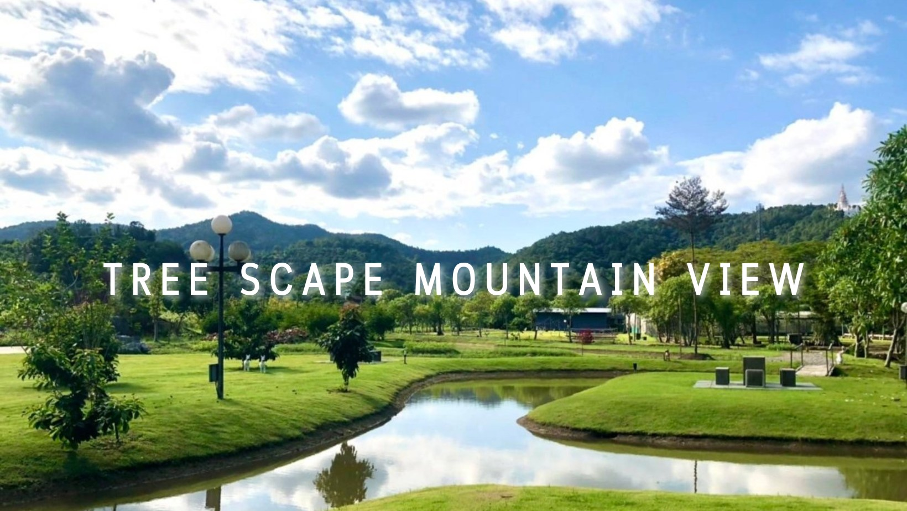

# 🌄 Mountain View

<figure><figcaption>
Source: <a href="https://www.facebook.com/treescapemountainview/">Facebook</a>
</figcaption></figure>

Welcome to Tree Scape Mountain View!

Just 30 minutes from Chiang Mai International Airport, this is a land of imagination hidden in the middle of Doi Suthep. Fields, rivers, streams, woods, modern living and working spaces... This is a  place where one can get away from the noise, and be in the midst of a dynamic nature that provides endless inspiration and motivation.

A place where you'll be with your closest community partners, thinking deeply about AI, crypto, community, decentralized-society, pluralism, transhumanism, and more. Here, cutting-edge ideas and knowledge are spread everywhere, and this place provides the best ground for deep thinking and co-creating.

Here are some helpful tips about the neighborhood:

Transportation

* Use Bolt/Grab/InDrive App
* Location: [Google Map](https://goo.gl/maps/MinDRyqzugH79Y2R9)

Laundry

* Laundry service is available at the hotel for an additional fee.

Cafe

*   **BARDRY**\
    Location: [Google Map](https://goo.gl/maps/eTRyuBWmsjAhrAyg7)

    <figure><figcaption>
Source: Google Map
</figcaption></figure>

Restaurants

*   #### Big Tree - Thai Food 🇹🇭

    Eating in the mountain streams of northern Thailand.\
    Location:  [Google Map](https://goo.gl/maps/72K6g9tApdvCCqeR9)

    <figure><figcaption>
Source: Google Map
</figcaption></figure>
*   **Little Glass House Cafe - Italian Restaurant 🇮🇹** \
    This is considered by many to be the best Italian restaurant in town, and many people will come from far away to eat here, so we highly recommend trying it out. World-class quality with reasonable price.\
    Location: [Google Map](https://goo.gl/maps/KVWeYDRJqc5NPKSJA)

    <figure><figcaption>
Source: Google Map
</figcaption></figure>
*   #### Flavour Hill Bistro & Farm 🌾

    This is a very cute farm restaurant, and all the dishes on their menu are homegrown and very fresh and healthy.\
    Location: [Google Map](https://goo.gl/maps/WevZqt5x2VMi7CFp9)

    <figure><figcaption>
Source: Google Map
</figcaption></figure>
*   #### Hoppipolla - SteakHouse 🥩

    Superb American style barbecue!\
    Location:[ Google Map](https://goo.gl/maps/cTYwyLoyCMkXBefb6)\
    Reservation: 0951423561

    Open: 6PM-10PM

    Close: Monday

    <figure><figcaption>
Source: <a href="https://www.facebook.com/hoppipollachiangmai?locale=th_TH">Facebook</a>
</figcaption></figure>

Bars

*   #### I Hate Mondays - Beer Store 🍺

    Very good craft beer and IPA here, good prices and quality, superb vibe, right next door to the grill above.\

    <figure><figcaption>
Source:<a href="https://www.facebook.com/IHateMondays.ChiangMai?locale=fi_FI"> Facebook</a>
</figcaption></figure>

Shopping

*   #### Kad Farang

    In Thai language, "Kad" means "village", "farang" means "white people". This area has historically been inhabited by many expats, so it has a well-established business system where you will feel no different from being in the United States - Starbucks, Western restaurants, Korean restaurants, Japanese restaurants, international supermarkets, and even outlet.&#x20;

    It is only about 15 minutes from the Mountain View, and you can buy all the things and services you need here. Every Wednesday and weekends they also have night market here.

    Location: [Google Map](https://goo.gl/maps/Jew8fNhZtBcPywp97)\

    <figure><figcaption>
Source: <a href="http://kadfarangvillage.com/?page=aboutus&#x26;lg=en">Kad Farang Village</a> 
</figcaption></figure>
*   #### Makro Hangdong

    Huge supermarkets. Just 18 minutes from the Mountain View.\
    Location: [Google Map](https://goo.gl/maps/KHdp3cGzKinvtmsH6)

    <figure><figcaption>
Source: Google Map
</figcaption></figure>
*   #### Big C Super Center

    Huge supermarkets. Just 18 minutes from the Mountain View.\
    Location: [Google Map](https://goo.gl/maps/tch6TW22gU7Vjeiv6)

    <figure><figcaption>
Source: Google Map
</figcaption></figure>

